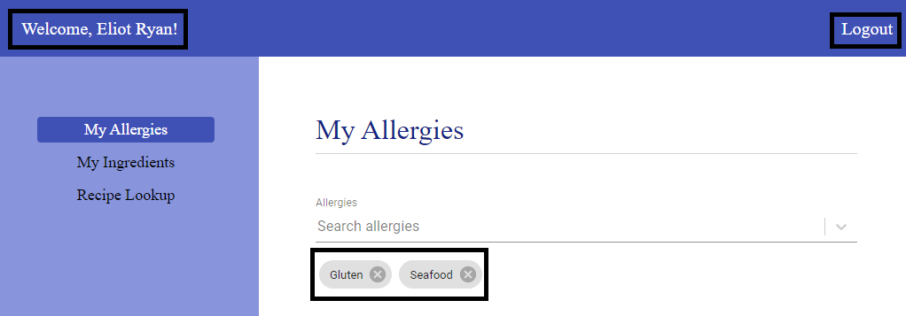
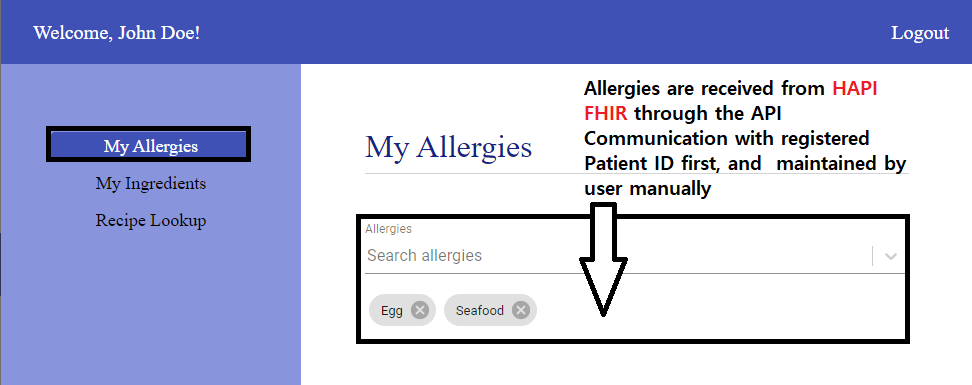
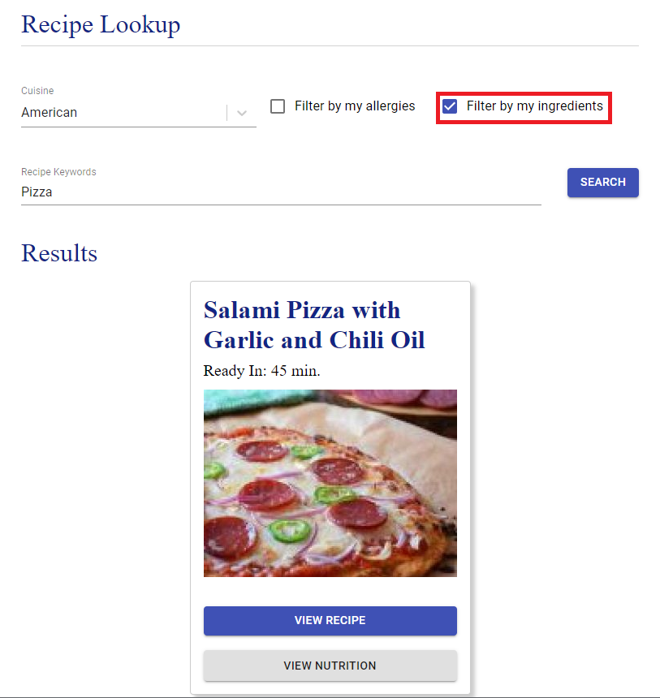

# Application Mannual

**Author**: RunTime Terror

### 1. Application Access
Access our Food Planner application using the below url. It takes you to the initial page with login for account management in the upper right corner and the Menu Navigation on the left side.

_URL: https://apps.hdap.gatech.edu/newfoodplanner2frontend/_

### 2. Account Management
#### 2.1 Log In
By clicking Login from the initial page, you can access login page. Using the test credential below, we can sign into the application. 

_Username: test, Password: test_

#### 2.2 Sign Up
Clicking "Sing up" button takes you to Sign Up page. Enter the required information as well as current allergies. It will create an account on FoodPlanner as well as register the one as a patient with allergy conditions on HAPI FHIR.  

#### 2.3 Log out  
After singing into the application, you can see the user's name displayed on the left hand corner and the entered allergy conditions are preserved on the bottom of the allergy search bar. Lastly, by clicking "LogOut" on right top corner, it will sign you out. 

### 3. My Allergies
Through the left side bar, you will be able to find "My Allergies" page. This will show you the current allergies and allow you to edit them. The allergy information is received via HAPI FHIR communication first using FHIR patientID, and maintained by user input. This allergy data will preserves when you refresh the page.    

* Search allergies: Typing few characters of the allergen on the search bar will populate a list of matching items.  
    
* Add allergies: By selecting the one from the list, the allergen will be registered on the bottom of the search bar. 
* Delete allergies: Clicking X button next to the saved allergen will delete it from your allergies.

### 4. My Ingredients
Similarly, Using the left side bar, you will be able to find "My Ingredients" page. This will show you the current ingredient you have and allow you to edit them. The ingredient search result are coming from Spoonacular API, and the saved list of ingredient are maintained by user. In the same way with allergy, the ingredient data will preserves when you refresh the page.    

* Search ingredients: Typing few characters of the ingredient on the search bar will populate a list of matching items.  
* Add ingredients: By selecting the one from the list, the ingredient will be registered on the bottom of the search bar. 
* Delete ingredient: Clicking X button next to the saved ingredient will delete the item from the saved list.

### 5. Recipe Look up
Lastly, through the left side bar, you will find the "Recipe Loop up" menu. This page will take your allergies and ingredients as input and come up with the meal planning options. The application pulls data from Spoonacular API.

