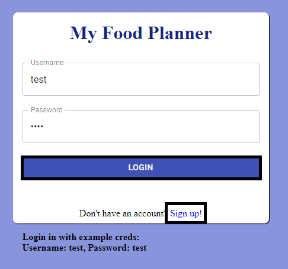
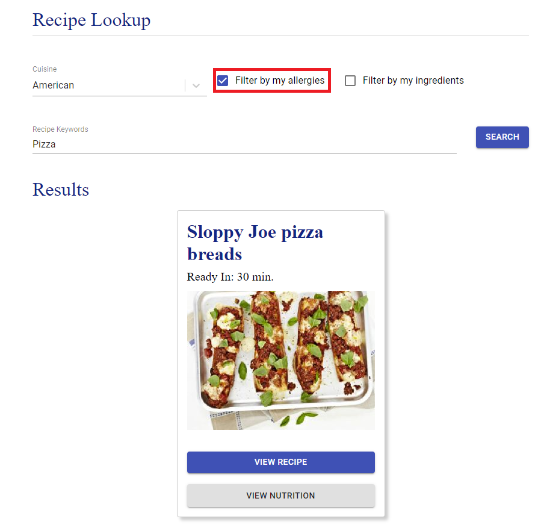

# Application Manual

**Author**: RunTime Terror

### 1. Application Access
Access our Food Planner application using the below url. It directs you to the application with Login in the upper right corner and the Menu Navigation on the left side.

_URL: https://apps.hdap.gatech.edu/newfoodplanner2frontend/_

### 2. Account Management
#### 2.1 Log In
By clicking Login from the initial page, you can access the login page. Using the test credential below, we can sign into the application. 

_Username: test, Password: test_

#### 2.2 Sign Up
Clicking "Sing up" button takes you to the Sign Up page. Enter the required information as well as current allergies. It will create an account on FoodPlanner as well as create a patient on HAPI FHIR with the allergy conditions .  

#### 2.3 Log out  
After signing into the application, you can see the user's name displayed on the left hand corner and the entered allergy conditions are saved on the bottom of the allergy search bar. Lastly, by clicking "LogOut" in the top right corner, it will sign you out. 

### 3. My Allergies
Through the left side bar, you will be able to find "My Allergies" page. This will show you the current allergies and allow you to edit them. The allergy information is also received via HAPI FHIR communication using FHIR patientID and maintained by user input. This allergy data will be preserved when you refresh the page.    

* Search allergies: Typing a few characters of the allergen on the search bar will populate a list of matching items.  
    
* Add allergies: By selecting the one from the list, the allergen will be registered on the bottom of the search bar. 
* Delete allergies: Clicking X button next to the saved allergen will delete it from your allergies.

### 4. My Ingredients
Similarly, using the left side bar you will be able to find "My Ingredients" page. This will show you previously added ingredients and allow you to edit them. The ingredient search results are pulled from Spoonacular API and the saved list of ingredients are maintained by user. In the same way with allergies, the ingredient data will br preserved when you refresh the page.    

* Search ingredients: Typing a few characters of the ingredient on the search bar will populate a list of matching items.  
* Add ingredients: By selecting the one from the list, the ingredient will be registered on the bottom of the search bar. 
* Delete ingredient: Clicking X button next to the saved ingredient will delete the item from the saved list.

### 5. Recipe Look up
Lastly, on the left side bar, you will find the "Recipe Look up" menu. This page will take your allergies and ingredients as input and recommend the meal planning options. The recipes are received from Spoonacular API.   
* Search recipes: You can search by type of "Cuisine" and "Recipe Keyword". If you do not enter any information into these search fields, the query will return all categories.The user can also filter results by their "Allergies" and their "Ingredients".

    As shown in the example, a cuisine of American and keyword of pizza was used and resulted in three hits that matched those inputs without the "Allergy" or "Ingredient" filter set. 
    

    Once the allergy filter is enabled, two pizzas that contain seafood and eggs are removed from the results based on the users saved allergies in their profile. 

    

    When the "Ingredients" filter is enabled, the pizza that contains salami is the only result based on the saved ingredients for the user profile.

    

* View recipes: By clicking "View Recipe" button, it will direct you to a web page with the recipe detail.
* View Nutrition: By clicking "View Nutrition" button, the application populates a page with the total calories of the recipe and a pie chart of nutritional information.
    
    
