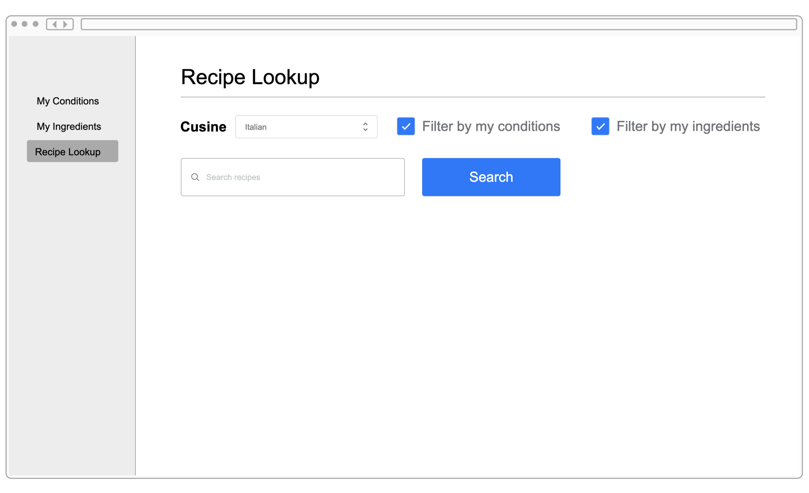

# Design Document

**Author**: Donald Ford
**Team**: Runtime Terror

## 1 Design Considerations

_The subsections below describe the issues that need to be addressed or resolved prior to or while completing the design, as well as issues that may influence the design process._

### 1.1 Assumptions

_Describe any assumption, background, or dependencies of the software, its use, the operational environment, or significant project issues. At this point you are only limited by the project description given and the HDAP environment._

### 1.2 Constraints

_Describe any constraints on the system that have a significant impact on the design of the application. This includes any gaps of knowledge that your team may have._

### 1.3 System Environment

_Remember to watch the Intro to HDAP lecture prior to starting. Describe the hardware and software that the system must operate in and interact with._

## 2 Architectural Design

_Remember to watch the Intro to HDAP lecture prior to starting. The architecture provides the high-level design view of a system and provides a basis for more detailed design work. These subsections describe the top-level components of the system you are building and their relationships._

### 2.1 Component Diagram

_This section should provide and describe a diagram that shows the various components and how they are connected. This diagram shows the logical/functional components of the system, where each component represents a cluster of related functionality. In the case of simple systems, where there is a single component, this diagram may be unnecessary; in these cases, simply state so and concisely state why._

### 2.2 Deployment Diagram

_Remember to watch the Intro to HDAP lecture prior to starting. This section should describe how the different components will be deployed. This will vary by project. Similar to the previous subsection, this diagram may be unnecessary for simple systems; in these cases, simply state so and concisely state why._

## 3 Class and Other Diagrams

_You should provide and describe class diagrams based on what you have provided in the previous subsections. You also have the option to describe some dynamic aspects of your system using one or more behavioral diagrams, such as sequence and state diagrams, but it is not required._

## 4 User Interface Design

