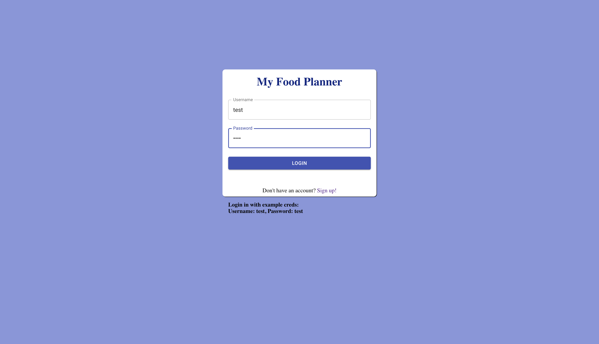
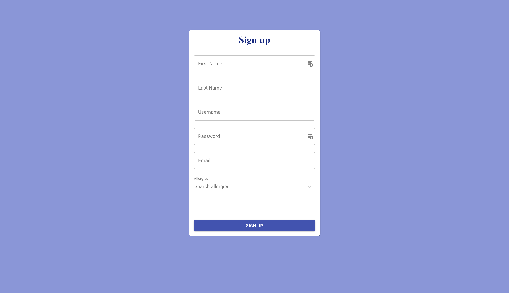
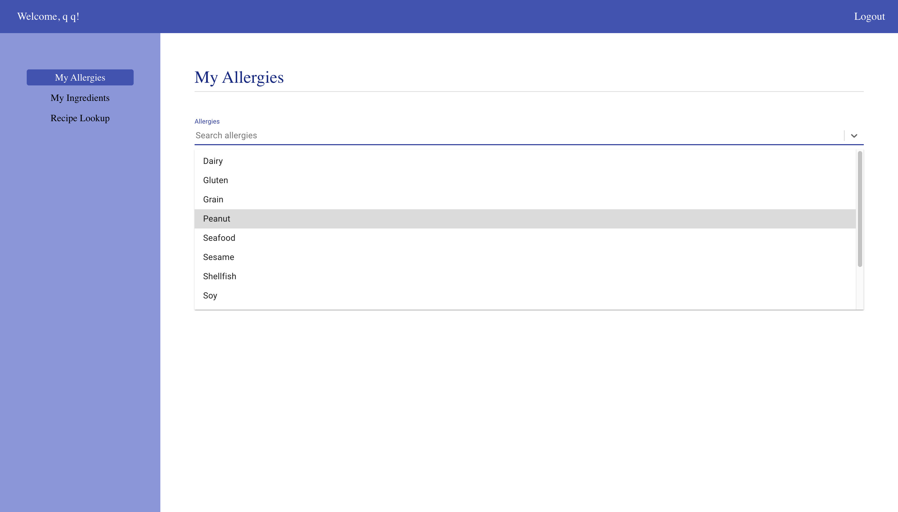
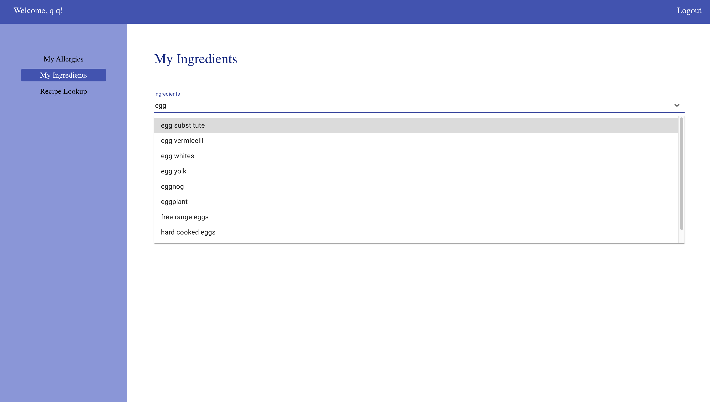
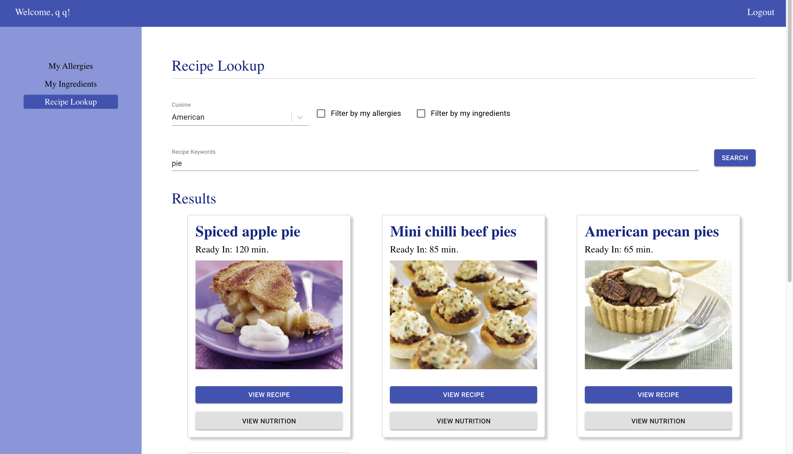
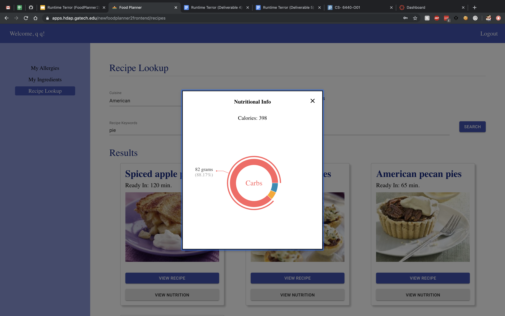

# Design Document

**Author**: Donald Ford, Youjung Kim
**Team**: Runtime Terror

## 1 Design Considerations

### 1.1 Assumptions

This project will be hosted using HDAP.

There will be a Java backend application used in order to request the data needed from external APIs.

A front end JavaScript application will be created. It will be created leveraging the React JavaScript framework. Create React App will be used in order to create the front end application. Under the hood it uses webpack to perform JavaScript package bundling. Yarn will be used in order to install dependencies and to perform local development.

In order to create the designs for this application the website [Proto.io](http://proto.io) was used. Component diagrams were created using LucidChart.

### 1.2 Constraints

There may be a lack of data that will allow us to map allergies/conditions to ingredients/recipes. Some APIs provide some mapping, but it is not likely that we will be able to find a truly comprehensive list, since there are countless ingredients and conditions and not all mappings can feasibly be created. We may need to add some sort of disclaimer saying that a dietician should be consulted since it might not be possible to programmatically account for every scenario. There may also be constraints on the number of API calls we are able to perform in a day. Several APIs we have explored put limits on the calls you can make, so this may limit how much this app can be used (without us needing to pay to use the service).

There are still knowledge gaps on how to perform the mapping between ingredients and conditions. Further research will be conducted in order to fill these gaps and to try and leverage the most suitable data sets and APIs.

### 1.3 System Environment

The application is implemented using Health Data Analytics Platform(HDAP). HDAP is a software platform providing various support on conducting health-oriented projects. It provides healthcare data, tools to analyze the data as well as a healthcare application development and hosting environment and app galleries.
We will utilize HDAP in terms of accessing FHIR servers and application deployment first. Furthermore, HDAP has multiple data sets and analytic tools(ATLAS, Jupyter) to support the development of our projects. We will exploit the resources to generate positive results.

HDAP has an automated development pipeline for Continuous Integration(CI) and Continuous Deployment(CD). Listed below are the open source development tools we are engaged with in the development process and we will make use of each tool for different purposes.

- GitHub – hosting service for version control using Git
- Drone– open source continuous delivery platform
- Docker Registry – server side application that stores and provides access to Docker images.
- Helm – a tool for managing configuration and deployment of Kubernetes applications.
- Rancher – open source Kubernetes management platform
- Kubernetes –open-source system for automating deployment, scaling, and management of containerized applications.
- Apache HTTP – open source HTTP server used by HDAP for routing requests to deployed containers

## 2 Architectural Design

Below presents the architecture as a series of diagrams; Component Diagram and Deployment Diagram.

### 2.1 Component Diagram

### 2.2 Deployment Diagram

## 3 Class and Other Diagrams

#### Front end application component diagram

## 4 User Interface Design

