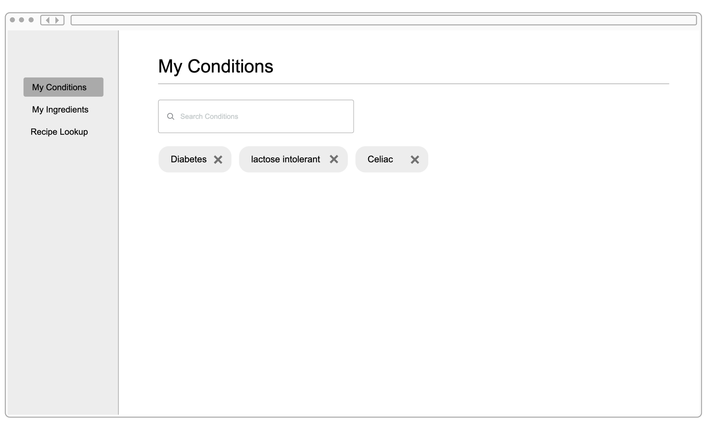

# Design Document

**Author**: Donald Ford
**Team**: Runtime Terror

## 1 Design Considerations

### 1.1 Assumptions

_Describe any assumption, background, or dependencies of the software, its use, the operational environment, or significant project issues. At this point you are only limited by the project description given and the HDAP environment._

This project will be hosted using HDAP.

There will be a Java backend application used in order to request the data needed from external APIs.

A front end JavaScript application will be created. It will be created leveraging the React JavaScript framework. Create React App will be used in order to create the front end application. Under the hood it uses webpack to perform JavaScript package bundling. Yarn will be used in order to install dependencies and to perform local development.

In order to create the designs for this application the website [Proto.io](http://proto.io) was used. Component diagrams were created using LucidChart.

### 1.2 Constraints

_Describe any constraints on the system that have a significant impact on the design of the application. This includes any gaps of knowledge that your team may have._

There may be a lack of data that will allow us to map allergies/conditions to ingredients/recipes. Some APIs provide some mapping, but it is not likely that we will be able to find a truly comprehensive list, since there are countless ingredients and conditions and not all mappings can feasibly be created. We may need to add some sort of disclaimer saying that a dietician should be consulted since it might not be possible to programmatically account for every scenario. There may also be constraints on the number of API calls we are able to perform in a day. Several APIs we have explored put limits on the calls you can make, so this may limit how much this app can be used (without us needing to pay to use the service).

There are still knowledge gaps on how to perform the mapping between ingredients and conditions. Further research will be conducted in order to fill these gaps and to try and leverage the most suitable data sets and APIs.

### 1.3 System Environment

_Remember to watch the Intro to HDAP lecture prior to starting. Describe the hardware and software that the system must operate in and interact with._

## 2 Architectural Design

_Remember to watch the Intro to HDAP lecture prior to starting. The architecture provides the high-level design view of a system and provides a basis for more detailed design work. These subsections describe the top-level components of the system you are building and their relationships._

### 2.1 Component Diagram

_This section should provide and describe a diagram that shows the various components and how they are connected. This diagram shows the logical/functional components of the system, where each component represents a cluster of related functionality. In the case of simple systems, where there is a single component, this diagram may be unnecessary; in these cases, simply state so and concisely state why._

### 2.2 Deployment Diagram

_Remember to watch the Intro to HDAP lecture prior to starting. This section should describe how the different components will be deployed. This will vary by project. Similar to the previous subsection, this diagram may be unnecessary for simple systems; in these cases, simply state so and concisely state why._

## 3 Class and Other Diagrams

_You should provide and describe class diagrams based on what you have provided in the previous subsections. You also have the option to describe some dynamic aspects of your system using one or more behavioral diagrams, such as sequence and state diagrams, but it is not required._

#### Front end application component diagram

## 4 User Interface Design

