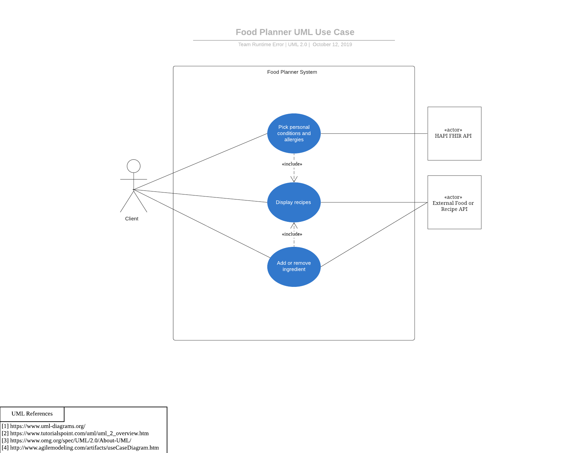

# Use Case Model

**Author**: Runtime Terror

## 1 Use Case Diagram

## 2 Use Case Descriptions

- Requirements: A user should be able to find food recipes through food planner web application.
- Pre-conditions: The user should be able to pick his/her medical conditions, food allergies and preferred ingredients.
- Post-conditions: The user will see a list of food recipes.
- Scenarios: 
  1. The user opens the food planner web application and then he/she can add food allergies and medical conditions.
  2. The user then picks a few of the ingredients he/she would like to have in the recipes.
  3. Then the user can search for food recipes based on conditions 1 and 2.
  4. The food planner web application should display the list of food recipes.
